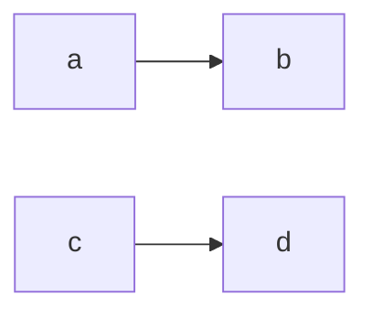
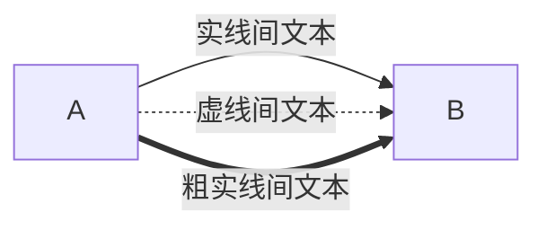
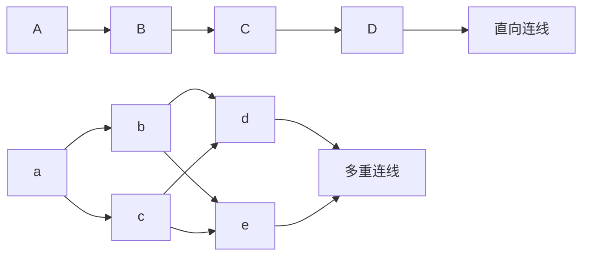
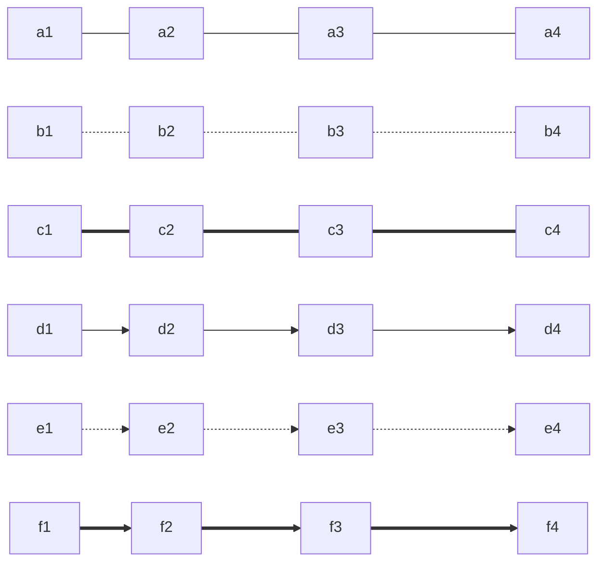

依赖 mermaid 支持，**遵循语法进行书写可实现渲染出图**

# 流程图

- 关键字
	- flowchart
- 方向
	- TB(top to bottom)
	- BT(bottom to top)
	- LR(left to right)
	- RL(right to left)

Mermaid 语句的结束，有两种方式:**在结尾加分号**；**换行**

````

````


## 连线

### 线种类

````
```mermaid
flowchart LR
	A---实线; %% AB之间，以一条实线连接
	A-.-虚线; %% AB之间，以一条虚线连接
	A===粗实线; %% AB之间，以一条粗实线连接
	A-->箭头实线; %% AB之间，以一条箭头实线连接
	A-.->箭头虚线; %% AB之间，以一条箭头虚线连接
	A==>箭头粗实线; %% AB之间，以一条箭头粗实线连接
	A~~~不可见 %%可用于节点定位
```
````

```mermaid
flowchart LR
	A---实线; %% AB之间，以一条实线连接
	A-.-虚线; %% AB之间，以一条虚线连接
	A===粗实线; %% AB之间，以一条粗实线连接
	A-->箭头实线; %% AB之间，以一条箭头实线连接
	A-.->箭头虚线; %% AB之间，以一条箭头虚线连接
	A==>箭头粗实线; %% AB之间，以一条箭头粗实线连接
```

````
```mermaid
flowchart RL
	反向实线箭头-->A; %% 这是一条从B到A的反向实线箭头
```
````

```mermaid
flowchart RL
	反向实线箭头-->A; %% 这是一条从B到A的反向实线箭头
```

### 箭头类型

````
```mermaid
flowchart LR 
	A --o 实线o;  %% 实线o
	A --x 实线x;  %% 实线x
	A -.-o 虚线o; %% 虚线o
	A -.-x 虚线x; %% 虚线x
	A ==o 粗实线o;  %% 粗实线o
	A ==x 粗实线x;  %% 粗实线x
```
````

```mermaid
flowchart LR 
%% 使用flowchart关键字
	A --o 实线o;  %% 实线o
	A --x 实线x;  %% 实线x
	A -.-o 虚线o; %% 虚线o
	A -.-x 虚线x; %% 虚线x
	A ==o 粗实线o;  %% 粗实线o
	A ==x 粗实线x;  %% 粗实线x
```

### 多向箭头

有三种: 使用首尾相同的 o 或 x，或者一对 < >; 不能使用 o--x 这样首尾不同的

````
```mermaid
flowchart LR 
	%% 实线
	A o--o B; %% 多向实线o
	C <--> D; %% 多向实线箭头
	E x--x F; %% 多向实线x
	%% 虚线
	G o-.-o H; %% 多向虚线o
	I <-.-> J; %% 多向虚线箭头
	K x-.-x L; %% 多向虚线x
	%% 粗实线
	M o==o N; %% 多向粗实线o
	O <==> P; %% 多向粗实线箭头
	R x==x S; %% 多向粗实线x
```
````

```mermaid
flowchart LR 
	%% 实线
	A o--o B; %% 多向实线o
	C <--> D; %% 多向实线箭头
	E x--x F; %% 多向实线x
	%% 虚线
	G o-.-o H; %% 多向虚线o
	I <-.-> J; %% 多向虚线箭头
	K x-.-x L; %% 多向虚线x
	%% 粗实线
	M o==o N; %% 多向粗实线o
	O <==> P; %% 多向粗实线箭头
	R x==x S; %% 多向粗实线x
```

### 连线文本

#### 嵌入式

````
```mermaid
flowchart LR
	A--嵌入式:实线间的文本-->B; %% AB之间以实线连接，且有一段连线文本
	A-.嵌入式:虚线间的文本.->B; %% AB之间以虚线连接，且有一段连线文本
	A==嵌入式:粗实线间的文本==>B; %% AB之间以粗实线连接，且有一段连线文本
```
````

```mermaid
flowchart LR
	A--嵌入式:实线间的文本-->B; %% AB之间以实线连接，且有一段连线文本
	A-.嵌入式:虚线间的文本.->B; %% AB之间以虚线连接，且有一段连线文本
	A==嵌入式:粗实线间的文本==>B; %% AB之间以粗实线连接，且有一段连线文本
```

#### 外部式

````

````


### 连线形式

````

````


> [!note]  
> 多重连线中的&表示与关系，如a-->b & c-->d，表示a连接到b与c，b与c连接到d

### 线条长度

线条可以增加长度，默认为**1 级**，可加至**3 级**

````

````


````
```mermaid
flowchart LR
	%% 实线
	a1 o--o a2 o---o a3 o----o a4; %% 多向实线o
	b1 <--> b2 <---> b3 <----> b4; %% 多向实线箭头
	c1 x--x c2 x---x c3 x----x c4; %% 多向实线x
	
	%% 虚线
	d1 o-.-o d2 o-..-o d3 o-...-o d4; %% 多向虚线o
	e1 <-.-> e2 <-..-> e3 <-...-> e4; %% 多向虚线箭头
	f1 x-.-x f2  x-..-x f3 x-...-x f4; %% 多向虚线x
	
	%% 粗实线
	g1 o==o g2 o===o g3 o====o g4; %% 多向粗实线o
	h1 <==> h2 <===> h3 <====> h4; %% 多向粗实线
	i1 x==x i2 x===x i3 x====x i4; %% 多向粗实线x
```
````

```mermaid
flowchart LR
	%% 实线
	a1 o--o a2 o---o a3 o----o a4; %% 多向实线o
	b1 <--> b2 <---> b3 <----> b4; %% 多向实线箭头
	c1 x--x c2 x---x c3 x----x c4; %% 多向实线x
	
	%% 虚线
	d1 o-.-o d2 o-..-o d3 o-...-o d4; %% 多向虚线o
	e1 <-.-> e2 <-..-> e3 <-...-> e4; %% 多向虚线箭头
	f1 x-.-x f2  x-..-x f3 x-...-x f4; %% 多向虚线x
	
	%% 粗实线
	g1 o==o g2 o===o g3 o====o g4; %% 多向粗实线o
	h1 <==> h2 <===> h3 <====> h4; %% 多向粗实线
	i1 x==x i2 x===x i3 x====x i4; %% 多向粗实线x
```

### 节点间的多条连线

````
```mermaid
flowchart TB
	得出答案A-->确定么?-->|确定|好吧;
	好吧-->再想一想-->|不对劲|确定么?---->|恍然大悟|修正为答案B;
```
````

```mermaid
flowchart TB
	得出答案A-->确定么?-->|确定|好吧;
	好吧-->再想一想-->|不对劲|确定么?---->|恍然大悟|修正为答案B;
```

## 节点

### 节点的容器 (名)

不使用容器，复杂的文本如英文词组中的空格会报错。

````
```mermaid
flowchart BT
	id1[我]-->id2[父亲]
	id1-->id3[母亲]
	
	id2--妈妈-->id4[奶奶]
	id2--爸爸-->id5[爷爷]
	
	id3--妈妈-->id6[外婆]
	id3--爸爸-->id7[外公]
```
````

```mermaid
flowchart BT
	id1[我]-->id2[父亲]
	id1-->id3[母亲]
	
	id2--妈妈-->id4[奶奶]
	id2--爸爸-->id5[爷爷]
	
	id3--妈妈-->id6[外婆]
	id3--爸爸-->id7[外公]
```

### 节点形状

````
```mermaid
flowchart LR
	id1[矩形]-->id2((圆形))-->id3{菱形}-->id4(圆角矩形)
	id5([跑道形])-->id6[/平行四边形/]-->id7[\反向平行四边形\]-->id8[/梯形\]
	id9[\倒立梯形/]-->id10>燕尾型]-->id11[(圆柱形)]
```
````

```mermaid
flowchart LR
	id1[矩形]-->id2((圆形))-->id3{菱形}-->id4(圆角矩形)
	id5([跑道形])-->id6[/平行四边形/]-->id7[\反向平行四边形\]-->id8[/梯形\]
	id9[\倒立梯形/]-->id10>燕尾型]-->id11[(圆柱形)]
```

### 会报错的文本

容器命名时 end 会报错，文本中不会

在文本内容输入 `[ ] { } ( )`，会报错；`> \ /` 可以用，不会报错；一些生僻的汉字、部首，也会报错

那么，要怎样才能 在文本内容中 显示这些会报错的字符呢？可以使用，双引号 `" "`

使用 双引号 " " 包裹，可以让破坏语法的字符，合法地进入节点，不会报错

## 子图

### 子图创建

````
```mermaid
flowchart TB
    subgraph sub1[one 子图1]
    a1-->a2;
    end;
	
    subgraph sub2[two 子图2]
    b1-->b2;
    end;
	
    subgraph sub3[three 子图3]
    c1-->c2;
    end;
	
	%% 节点与节点的连接
	c1-->a2;
	
	%% 子图与子图的连接
    sub1-->sub2;
    sub3-->sub2;
	
	%% 子图与节点的连接
    sub2-->c2;
```
````

```mermaid
flowchart TB
    subgraph sub1[one 子图1]
    a1-->a2;
    end;
	
    subgraph sub2[two 子图2]
    b1-->b2;
    end;
	
    subgraph sub3[three 子图3]
    c1-->c2;
    end;
	
	%% 节点与节点的连接
	c1-->a2;
	
	%% 子图与子图的连接
    sub1-->sub2;
    sub3-->sub2;
	
	%% 子图与节点的连接
    sub2-->c2;
```

> [!warning]  
>  子图容器必须用中括号 [ ]，其他不行，容器名 [子图名文本]

### 子图嵌套

````
```mermaid
flowchart LR
	subgraph 子图
	%% 声明子图
	direction TB  %% 子图方向
		subgraph 子图1
        direction RL %% 子图1方向
        i1-->f1
		end
		
    	subgraph 子图2
        direction BT %% 子图2方向
        i2-->f2
		end
	end
  
  %% 主图
  A-->子图-->B
  子图1-->子图2
```
````

```mermaid
flowchart LR
	subgraph 子图
	%% 声明子图
	direction TB  %% 子图方向
		subgraph 子图1
        direction RL %% 子图1方向
        i1-->f1
		end
		
    	subgraph 子图2
        direction BT %% 子图2方向
        i2-->f2
		end
	end
  
  %% 主图
  A-->子图-->B
  子图1-->子图2
```
